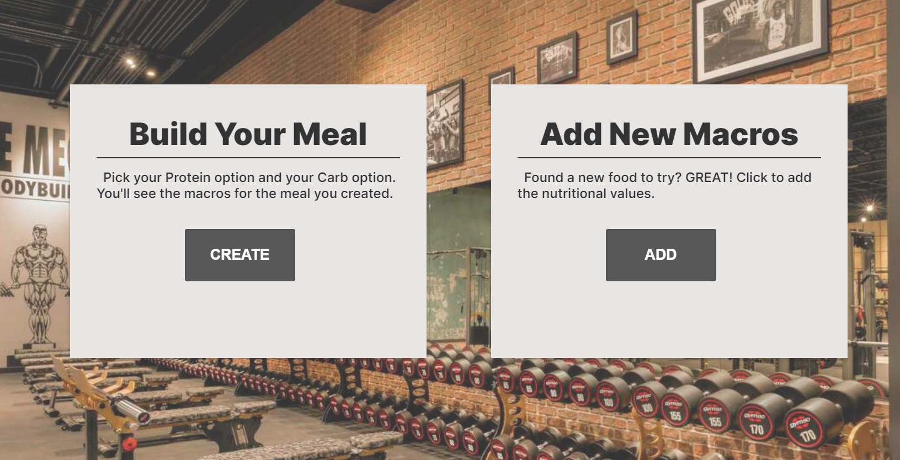
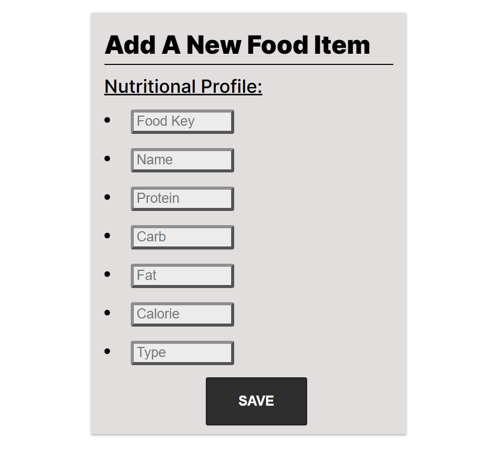
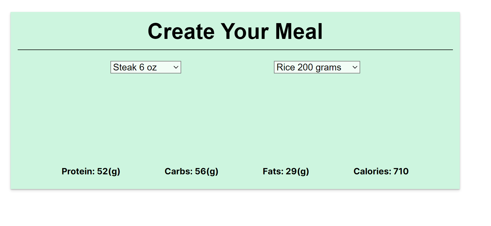

# health-app

I have created an nutrition app with 2 main functions.
First is to add the nutritional values(macros) for a single item.
Second is to Create your meal, using the data added to our DB, you can select your Protein choice and your Carb choice and it will return the macros for your meal.

_This is a Full Stack App_
_Other folders in Github are not finished at this time_

